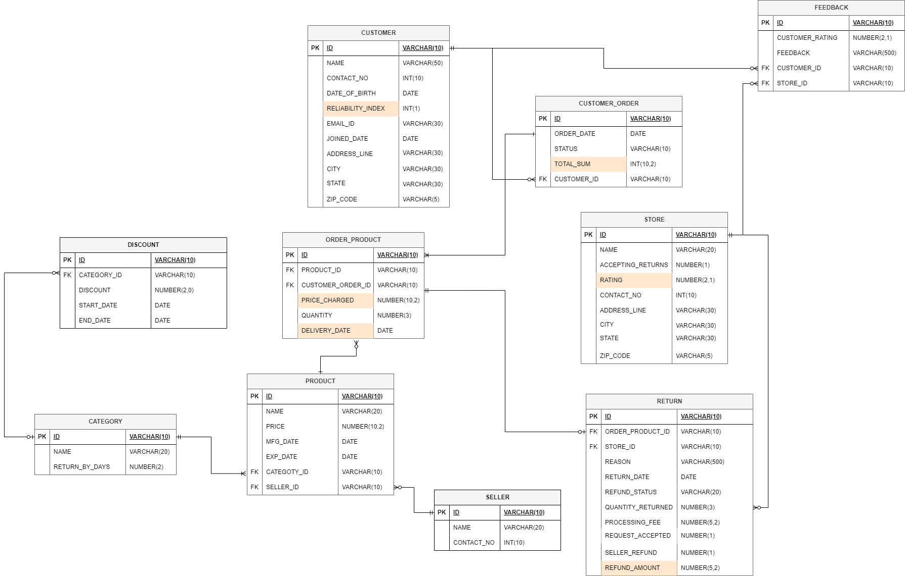
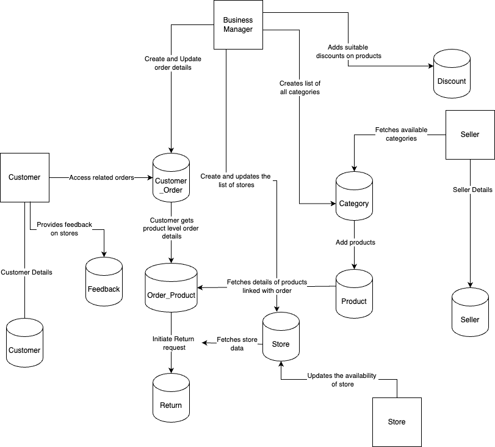

# Optimizing Returns and Refunds in Supply Chain Management

## Project Overview

Returns and refunds management poses significant challenges in the current supply chain landscape, including high return rates, complex processing workflows, and inadequate customer reliability assessment. These challenges result in increased costs, potential disruptions, and customer dissatisfaction. To address these issues, we propose implementing a comprehensive online transaction management system.

## Problem Statement

1. **Challenges in Returns and Refunds:** The current supply chain management scenario faces various challenges related to returns and refunds, including high return rates and complex processing workflows.
   
2. **Inefficient Processes:** Inadequate customer reliability assessment and the absence of efficient approaches to handling returns contribute to inefficiencies, financial losses, and potential customer dissatisfaction.

## Proposed Solution

1. **Online Transaction Management System:** Implementing a comprehensive system to optimize returns and refunds processes within the supply chain.
   
2. **Innovative Approach:** Introducing a customer reliability scoring mechanism, efficient return request processing, refund processing, status tracking, exception handling, and processing returns based on conditional discount category.

## ER Diagram

## Data Flow Diagram

## Steps to execute the scripts and create the desired OLTP Database in Oracle

1.	Login with admin credentials.
2.	Execute the admin_grants.sql to grant permissions to the business manager.
3.	Login with business manager credentials.
    - Execute the DDL_DML.sql file to create tables and populate them with necessary default data.
    - Execute the views.sql file to create the required views.
    - Execute the reports.sql to create views for analysis.
    - Execute the procedures.sql file to create the required procedures.
4.	Login with customer credentials and execute the 1_customer_script.sql 
5.	Login with seller credentials and run the 2_seller_script.sql.
6.	Login with customer credentials and execute the 3_customer_script.sql
7.	Login with store credentials and execute the 4_store_script.sql
8.	Login with seller credentials and ex	ecute the 5_seller_script.sql
9.	Login with store credentials and execute the 6_store_script.sql
10.	Login with business manager credentials and execute the 7_reports_script.sql

## Objectives

- Enable customers to initiate return requests and establish functionality for efficient management and processing based on predefined criteria.
- Utilize Customer Reliability Scores to guide refund processing, enhancing accuracy and effectiveness.
- Implement robust tracking mechanisms for request status monitoring, ensuring transparency and accountability.
- Incorporate exceptional handling capabilities to address invalid requests seamlessly.
- Enhance operational efficiency through targeted partial refund processing for discounted products.
- Provide customers with store feedback for a smooth return experience, fostering communication and satisfaction.
- Design a core architecture to optimize the overall customer experience while mitigating operational expenditures.

## Business Rules

-	Each product is categorized, influencing the final price for customers. On special dates, each product category is associated with a distinct discount rate, resulting in variable final prices based on the date of purchase. 
-	The total order value is a derived attribute, calculated by considering the number of products in the order and their respective prices at the time of purchase. 
-	Products are ineligible for return if the customer initiates a return request after the specified "returnable date," which varies by product category, ensuring a streamlined and standardized return process. 
-	When a customer initiates a return order, the system initially verifies its conformity with the product's returnable date. Subsequently, a further examination is conducted based on the customer's reliability index to determine the appropriate refund amount. 
-	Customers can share feedback about the store where they processed their product return. This feedback serves as valuable information for other customers, assisting them in making informed decisions about which store to make returns. 
-	Each store receives a rating derived from the average of customer feedback, offering a concise and informative measure of its overall performance. 
-	Customers will receive a notification specifying the reason for the rejection of their return request.
-	If the request is rejected, then the processing fee will be 0. 
-	The processing fee for the return request would be:  
    - Total Refund = Price charged – Processing fee  
-	Order delivery date would be derived attribute and will be derived from Purchased date.
    - For food products, it will be 1-day delivery.
    - For the other products, it will be 2 days.
-	Only existing customers can initiate a return request and access order and product tables.
-	Only existing sellers can fetch categories and add products.
- Only existing store managers can update the status of the stores.

## Conclusion

The proposed solution aims to address the challenges associated with returns and refunds in supply chain management. By implementing a comprehensive online transaction management system and adhering to predefined business rules, we strive to optimize processes, enhance customer satisfaction, and reduce operational costs.

## Contributors
| Name                       | Email                            |
|----------------------------|----------------------------------|
| Muskan Deepak Raisinghani  | raisinghani.m@northeastern.edu   |
| Yashwanth Behara           | behara.y@northeastern.edu        |
| Kameswara Praneeth         | kattamuri.k@northeastern.edu     |
| Dev Mithunisvar Premraj    | premraj.d@northeastern.edu       |
